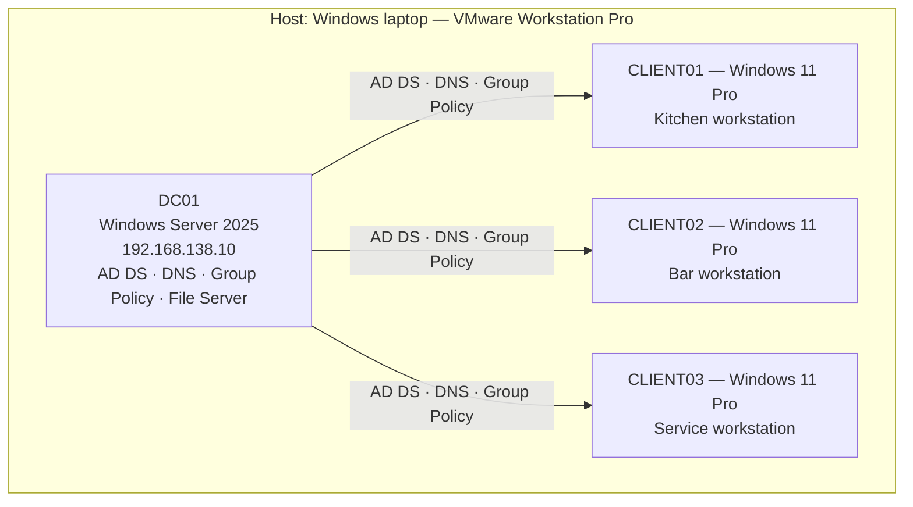
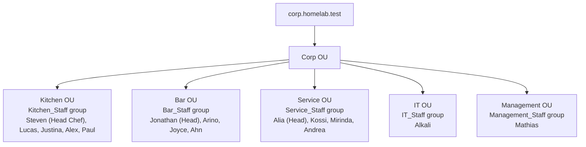

# IT Homelab — Active Directory, Group Policy & IT Support Troubleshooting

I built this as a self-contained Windows Server 2025 / Active Directory environment modeling a small restaurant business — not to follow a tutorial, but to actually learn IT support and sysadmin work by doing it. It covers domain administration, file/NTFS permissions, Group Policy, and troubleshooting real (and deliberately staged) problems without being told the cause up front.

**Author:** Alkali — CS student in Berlin, aiming for entry-level IT Support / Helpdesk roles, with cybersecurity/SOC as my longer-term direction.

---

## Overview

The lab is built around a small restaurant company (`corp.homelab.test`) with five departments — Kitchen, Bar, Service, IT, and Management. Each one has its own staff, security group, network share, and permission setup. On top of that I built out Group Policy: drive mapping, a password/lockout policy, and a security baseline for the workstations. The last phase was a set of IT support tickets where I intentionally broke something without letting myself know the cause in advance, then worked it the way an actual helpdesk ticket would go — figure out the symptom, narrow down where the problem could be, test a hypothesis, find the root cause, fix it, and verify it's actually fixed.

Two things I cared about doing properly here, not just "getting it to work":

- **Diagnosing before fixing.** Every issue below — whether I staged it or it happened on its own — I worked through with the actual tools an IT tech would use (ADUC, `gpresult`, `nltest`, `ipconfig`, NTFS ACLs), not by guessing and checking.
- **Documenting as I went.** This README, and the full log it's drawn from, were kept updated throughout the build — not written afterward from memory.

---

## Architecture

| | |
|---|---|
| **Hypervisor** | VMware Workstation Pro |
| **Domain Controller** | DC01 — Windows Server 2025 (`192.168.138.10`) |
| **Domain** | `corp.homelab.test` |
| **Clients** | CLIENT01–03 — Windows 11 Pro, domain-joined |
| **DC roles** | AD DS, DNS, Group Policy, file sharing |

---

## Active Directory structure

I built every department around a **security group** instead of individual permissions — that was the whole point of this part of the project: manage access by group membership, not by editing an ACL every time someone joins, leaves, or changes role.

**How I set up permissions:**
- I left **share permissions** wide open (`Authenticated Users` — Full Control) on every share, on purpose — all the real access control happens at the **NTFS** layer, so there's one place to manage it instead of two.
- Department groups get **Modify** on their own share — not Full Control, since they don't need it.
- `IT_Staff` gets **Read & Execute only** on Kitchen, Bar, and Service — enough to help with a ticket without being able to change or delete anything.
- `Management_Staff` is walled off completely — not even `IT_Staff` can get in, to model a genuinely confidential department.

---

## What I built

### Phase 1 — Department administration
Five departments, each with a security group, an SMB share, and an NTFS permission setup that I actually tested with authorized and unauthorized accounts — not just configured and assumed to be right. I did this partly through the GUI (ADUC, File Explorer) and partly through PowerShell (`New-ADGroup`, `Add-ADGroupMember`, `New-SmbShare`, `icacls`), specifically so I'd get comfortable with both.

### Phase 2 — Group Policy
- **Automatic drive mapping** for all five departments through Group Policy Preferences.
- A **domain-wide Password & Account Lockout Policy**, linked at the domain root — this is the one GPO category that actually has to be linked at the domain level rather than per-OU.
- A **workstation security baseline** — a 60-second idle screen lock and removable storage blocking — linked once at the parent `Corp` OU and inherited down through every department.

### Phase 3 — IT support troubleshooting labs
Five tickets that I staged for myself and then diagnosed without knowing the cause going in: a disabled account, a missing security group membership, a department-wide NTFS permission removal, a DNS misconfiguration, and a GPO that stopped applying. I'd planned a sixth category — domain trust failure — but I'd already hit that exact problem for real earlier in the build (see case study below), so I didn't bother staging a repeat of something I'd already lived through.

---

## Featured troubleshooting case studies

These five actually took real multi-step diagnosis, not just one obvious fix — the kind of thing I'd bring up if someone asked me to walk through a time I troubleshot something.

<strong>1. A ticket that stopped applying — but my first test lied to me</strong>

**Symptom:** I deliberately broke a GPO that maps a network drive (`K:`) — emptied its Security Filtering and disabled User Configuration. My first check afterward still showed the drive working fine, which looked like the break hadn't done anything.

**Investigation:** `gpresult /r` showed the GPO in *neither* the Applied list nor the "filtered out" list — which told me Group Policy didn't even consider the target eligible for it anymore. So instead of trusting that first test, I went back and questioned the test itself: the drive had already been written into the user's profile the day before, and Group Policy Preferences are a **one-time write**, not something Group Policy keeps enforcing. Breaking the source doesn't undo something that already landed.

**Fix & verification:** I fully removed the existing mapping on the client (`net use K: /delete`) and forced a clean logon — the drive didn't come back, which confirmed the break had actually taken effect. Restoring the GPO and repeating the test confirmed the fix worked too.

**Why it matters:** Catching that my *test* was flawed, not my fix, is a step above just fixing the obvious thing — and it's the kind of instinct I want to keep building.

<strong>2. A real misconfiguration I found by accident, weeks after I'd already closed Phase 3</strong>

**Symptom:** I wasn't testing anything — I was just doing a routine check — when I noticed the GPO that was supposed to own a department's drive mapping had a completely **empty** configuration. I refreshed the console, did a full shutdown/restart of the whole environment, and it stayed empty. Meanwhile the drive kept working fine for everyone.

**Investigation:** I ruled things out from simplest to most complex: console cache first (refresh), then session/OS-level cache (full restart), before trusting the live behavior over what the management console was showing me. Eventually I traced the setting to a **second GPO**, linked to the same OU, that had quietly been holding the configuration the whole time. Turns out Group Policy doesn't care which GPO delivers a setting, only that *some* applicable one does — so this misfiled item had been silently working (and hiding a real mistake in my setup) for weeks without me noticing.

**Fix:** I deleted the misfiled item, then ran into a second problem: deleting a Preference only stops it from being delivered *in the future* — it doesn't undo what's already been applied to clients that got it before. I used a temporary preference item with **Action = Delete**, which is the real technique for actively removing an already-delivered setting from every affected machine, then rebuilt the configuration correctly in the GPO it should've been in the whole time.

**Why it matters:** This is the case study I'm proudest of — it wasn't staged, I found it myself, and I worked it through with an actual methodology instead of just panicking and rebuilding things. The Action = Delete cleanup technique is something that scales to a real company, not just a homelab.

<strong>3. A GPO that silently wasn't applying because it lost to a built-in policy</strong>

**Symptom:** I set up a domain-wide Account Lockout Policy and it did nothing — accounts never locked out no matter how many times I failed a login on purpose.

**Investigation:** I found that the built-in `Default Domain Policy` already defined the same setting (Lockout Threshold = 0, i.e. off) with higher link-order precedence than my new GPO.

**Fix:** Instead of editing the built-in policy directly, I just moved my new GPO to the top of the link order. Since GPO conflicts get resolved per individual setting, that was enough to make every setting my GPO explicitly defined win, without touching Default Domain Policy at all.

**Why it matters:** This taught me that GPO conflicts resolve setting-by-setting, not GPO-by-GPO — something I got wrong in my head at first, and I think a lot of people new to Group Policy do too.

<strong>4. A setting RSoP said was "Applied" — but it never actually worked</strong>

**Symptom:** A screen-lock policy showed as fully applied in `rsop.msc`, but the screen never actually locked after the idle timeout I'd set.

**Investigation:** The session I was testing in had already been running *before* the policy fully propagated. A background `gpupdate /force` updates the registry and RSoP data, but it doesn't guarantee that an already-running session's screensaver watchdog picks up the new value live.

**Fix & verification:** A full logoff/logon made it start working, and I repeated the test on two separate machines/users to make sure it wasn't a one-off or something specific to that VM.

**Why it matters:** I learned that "confirmed delivered" and "actually in effect in this exact session" aren't the same thing — a layer of GPO troubleshooting I hadn't thought to check before.

<strong>5. A security group that vanished after I suspended the VM instead of shutting it down</strong>

**Symptom:** A group I'd already set up and verified came back as "object not found" the next day, after I'd suspended and resumed the domain controller VM instead of cleanly shutting it down.

**Investigation:** A sibling group I'd created earlier, and the department's shared folder I'd created later, both survived fine — which narrowed it down to something about how the VM saved its state, rather than a full snapshot revert.

**Fix:** I recreated the group, then realized that wasn't actually enough on its own — Windows permissions are tied to a group's **SID**, not its name, so the folder's ACL was still pointing at the old, now-deleted group's orphaned SID. I had to explicitly re-grant permissions to the new object.

**Why it matters:** Good reminder to me that a fix can look complete after the first step and still not actually be done — I verified it instead of just assuming it was fixed.

---

## Skills demonstrated

**Active Directory & Windows Server**
Deploying and administering a Windows Server 2025 AD domain from scratch (AD DS, DNS, Group Policy); department-based OU design; managing access through security groups; diagnosing broken computer/domain trust relationships; account administration (disabled/locked/expired states, password resets); recovering from AD object loss and orphaned-SID permission issues.

**File services & access control**
SMB share + NTFS permission layering; designing permissions around least privilege; diagnosing and fixing permission-inheritance leaks and department-wide permission-removal outages.

**Group Policy**
GPO Preferences vs. Policies; domain-linked vs. OU-linked scope; GPO precedence and per-setting conflict resolution; GPO inheritance down an OU tree; Computer vs. User Configuration; checking delivery (`gpresult`/`rsop.msc`) against live behavior; diagnosing Security Filtering and GPO Status faults; understanding — and correctly reversing — Group Policy Preferences that have already been delivered.

**Networking & DNS**
Domain-integrated DNS as the foundation of how AD locates services; SRV record queries; diagnosing a DNS-client misconfiguration that broke domain-controller location while general internet access kept working fine.

**IT support troubleshooting methodology**
Working through symptom → scope → hypothesis → test → root cause → fix → verify, on both real incidents and tickets I staged myself; telling apart session-level artifacts (stale sessions, cached tokens) from actual configuration faults; picking a valid comparison account when scoping an issue; recognizing when two different root causes can produce the exact same symptom; questioning whether my test itself was valid when a result looked wrong, instead of just accepting a false negative.

**Tools I used hands-on**
Active Directory Users and Computers, Group Policy Management / Group Policy Management Editor, Windows Server 2025, PowerShell (`New-ADGroup`, `Add-ADGroupMember`, `Get-ADGroup`, `Get-ADUser`, `Test-ComputerSecureChannel`, `Set-DnsClientServerAddress`), `icacls`, `nltest`, `nslookup`, `ipconfig`, `net use`, `gpresult`, `rsop.msc`, VMware Workstation Pro.

---

## Key lessons I learned

- **Group Policy Preferences are a one-time write, not something Group Policy keeps enforcing.** Breaking or deleting the GPO that created a setting doesn't undo it on machines that already got it — reversing it everywhere actually requires a proper `Action = Delete` preference item.
- **A setting isn't tied to one specific GPO object.** Group Policy only cares that *some* applicable, linked GPO delivers it — which means a misconfiguration can hide behind a symptom that happens to look fine, for a long time.
- **Trust live behavior over what a tool shows you, when they disagree.** A management console is just a reading of the system — it's not the system itself.
- **An already-open session can outlive the state that produced it.** A login that looks successful, an RSoP result that says "Applied," a drive that's still mapped — all of these can be leftovers instead of the current truth. Forcing a fresh logon is often the only real way to see what's actually going on.
- **How I scope an issue (one user vs. everyone) determines where I look first.** An individual-account problem and a shared-resource problem are different starting points, and getting that right early saves a lot of time.
- **The comparison account matters.** Testing with just any working account isn't good enough — it has to go through the exact same access path as the person actually affected.

---

## Documentation

This README is the condensed overview. Full detail lives in:

- [`docs/lab-journal.md`](docs/lab-journal.md) — the complete narrative build/troubleshooting log, in the order things actually happened, plus a commands & terminology reference
- [`docs/technical-reference.md`](docs/technical-reference.md) — exhaustive OU/user/group/share/GPO reference tables, for anyone who wants the exact configuration detail
- [`docs/skills-log.md`](docs/skills-log.md) — a CV-ready skills record, organized by competency area

## What's next

All four phases of this project — department administration, Group Policy, IT support troubleshooting labs, and documentation — are complete. Next, I'm moving from Windows/AD fundamentals into networking and cybersecurity: Wireshark, Windows Event Viewer, Windows Firewall, deeper Linux, log and authentication-event analysis, and eventually SOC-analyst-style detection and incident-investigation work, in an isolated homelab.

---

*This project is part of my ongoing, hands-on prep for entry-level IT Support / Helpdesk roles, with cybersecurity/SOC as where I want to end up.*

